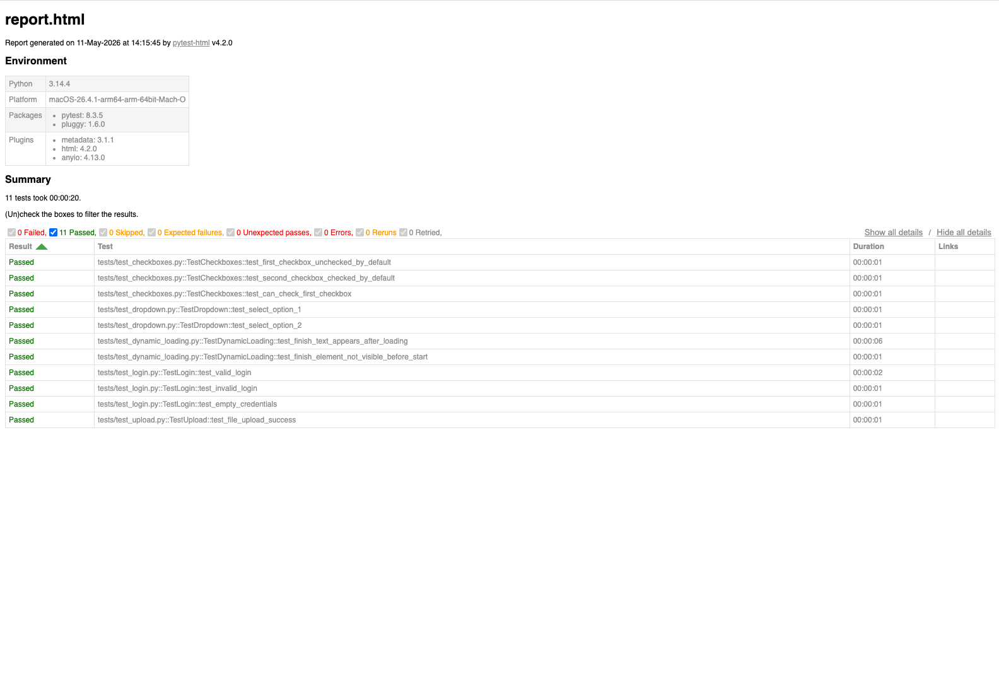

# Python Selenium Automation Suite

End-to-end UI test automation suite built with Python, Pytest, and Selenium WebDriver,
targeting [the-internet.herokuapp.com](https://the-internet.herokuapp.com), a site
purpose-built for demonstrating browser automation skills.


## Tech Stack
- Python 3.11
- Selenium WebDriver 4
- Pytest
- pytest-html
- webdriver-manager
- GitHub Actions (CI/CD)

## Test Coverage

| Module | Tests | Concepts Covered |
|--------|-------|-----------------|
| Login | 3 | Form input, valid/invalid credentials, flash messages |
| Dropdown | 2 | Select element handling |
| Checkboxes | 2 | Default state assertions, toggling state |
| Dynamic Loading | 2 | Explicit waits, dynamic content detection |
| File Upload | 1 | File path handling, upload confirmation |

**Total: 11 tests across 5 modules**

## Test Report



## Design Patterns
- **Page Object Model (POM)** : each page has its own class, keeping tests clean and maintainable
- **Pytest fixtures** : browser setup and teardown handled in `conftest.py`
- **Explicit waits** : used for dynamic content instead of unreliable sleep() calls
- **Headless Chrome** : tests run without opening a browser window, CI/CD compatible

## How to Run Locally

```bash
git clone https://github.com/prashantibhatt04/python-selenium-automation-suite.git
cd python-selenium-automation-suite
pip install -r requirements.txt
pytest -v
```

## CI/CD
Tests run automatically on every push via GitHub Actions.
See the [Actions tab](https://github.com/prashantibhatt04/python-selenium-automation-suite/actions) for live results.

## Project Structure
```
├── pages/                  # Page Object classes
│   ├── login_page.py
│   ├── dropdown_page.py
│   ├── checkboxes_page.py
│   ├── dynamic_loading_page.py
│   └── upload_page.py
├── tests/                  # Test files
│   ├── test_login.py
│   ├── test_dropdown.py
│   ├── test_checkboxes.py
│   ├── test_dynamic_loading.py
│   └── test_upload.py
├── conftest.py             # Shared browser fixture
├── pytest.ini              # Pytest config + HTML report settings
└── .github/workflows/      # GitHub Actions CI/CD
    └── tests.yml
```